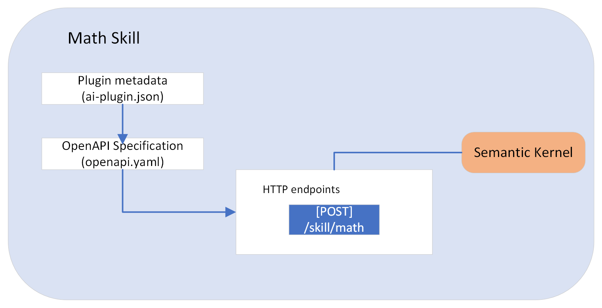

# semantic-kernel-example-ChatGPT-Plugin
Microsoft Semantic Kernel - Example application creating ChatGPT plugin using Native and Semantic function with Python and Azure Function App. In this example code, we demonstrate how to combine native functions with semantic functions to correctly answer word problems like What is the "square root of 634?", "square root of 144", "What is 42 plus 1513" or "multiply 2 times 4", etc.

## Microsoft Semantic Kernel

The [Microsoft Semantic kernel](https://learn.microsoft.com/en-us/semantic-kernel/ai-orchestration/kernel/?tabs=Csharp) is responsible for managing resources that are necessary to run "code" in an AI application. This includes managing the configuration, services, and plugins necessary for native code and AI services to run together.

Semantic Kernel makes it easy to run AI services alongside **native code** by treating calls to AI services as their first-class citizens called "semantic functions."

## AI Plugins

[AI Plugins](https://learn.microsoft.com/en-us/semantic-kernel/ai-orchestration/plugins/?tabs=Csharp) in Semantic Kernel are the fundamental building blocks of Semantic Kernel and can interoperate with plugins in ChatGPT, Bing, and Microsoft 365. With plugins, you can encapsulate capabilities into a single unit of functionality that the kernel can run. Plugins can consist of both **native code** and requests to AI services via **semantic functions**.

### Out-of-the-box Plugin

To provide a degree of standardization across Semantic Kernel implementations, the GitHub repo has several plugins available out-of-the-box depending on the language you are using. These plugins are often referred to as [Core plugins](https://learn.microsoft.com/en-us/semantic-kernel/ai-orchestration/plugins/out-of-the-box-plugins?tabs=python#core-plugins). 

In this example we are using `ConversationSummarySkill` to summarize a conversation with `GetIntent` semnatic function.

### Semantic Functions

Semantic Functions listen to users' asks and respond with a natural language response within your AI app. AI app operates very much like the human body; the Prompt represents "Ear", the Response as "Mouth", and the LLM model as "brain". Semantic Kernel uses connectors to connect the Prompt and the Response to the "brain". This allows you to easily swap out the AI services ("brain") without rewriting code.

We are going to use [Semantic Kernel prompt template language](https://learn.microsoft.com/en-us/semantic-kernel/prompt-engineering/prompt-template-syntax) to create natural language prompts, generate responses, extract information, etc.

#### `GetIntent` 

[`GetIntent`](./plugins/OrchestratorPlugin/GetIntent/) Semantic function is defined to understand the intent of a user's input and then take some action based on that intent. The following [configurations](https://learn.microsoft.com/en-us/semantic-kernel/prompt-engineering/configure-prompts) and out-of-the-box plugins are added to the intent so that the LLM chooses the correct intent.

- options - We want the LLM to choose the correct intent; for that, we are using the `options` configuration to choose the correct intent by providing it with more context and a constrained list of options.
- history - A history variable is added to the prompt configuration to include the previous conversation.
- [ConversationSummarySkill](https://learn.microsoft.com/en-us/azure/architecture/ai-ml/guide/conversation-summarization) Plugin - Summarize the conversation history before asking for the intent; this will avoid too many tokens being used.

#### `GetNumber`

[`GetNumber`](./plugins/OrchestratorPlugin/GetNumbers/) semnatic function is defined to pull the numbers from the user's input. This semantic function uses few-shot learning (user defined example conversation) to demonstrate to the LLM how to correctly extract the numbers from the user's request and output them in JSON format. This will allow us to easily pass the numbers to the Sqrt and Multiply functions.

### Native Functions

With Native Functions, you can have the Semantic kernel call C# or Python code directly so you can manipulate data or perform other operations, perform a task LLMs cannot do easily on their own. For example, you want to perform a task based on the intent that can be achieved using Semantic Functions. Now, if the user wants to send an email, you'll need to make the necessary API calls to send an email; this can be done using Native Functions.

#### Math Functions (Math.py File)

All native functions are public methods of [Math.py](./plugins/MathPlugin/Math.py) class that represents your plugin. Using [SKFunction decorator](https://learn.microsoft.com/en-us/semantic-kernel/ai-orchestration/plugins/native-functions/using-the-skfunction-decorator?tabs=Csharp#use-the-skfunction-decorator-to-define-a-native-function) we inform Semantic Kernel that It is a native function and will automatically register it with the kernel when the plugin is loaded.

#### RouteRequest

[RouteRequest](./plugins/OrchestratorPlugin/OrchestratorPlugin.py) is another Native function; It will leverage Semantic Functions (`GetIntent` and `GetNumber`) and call the appropriate Native functions (Math functions) based on the user's intent. Since the RouteRequest function helps orchestrate the flow, we have added the same to the `OrchestratorPlugin` plugin. The `route_request` function is decorated using the SKFunction decorator to inform Semantic Kernel that It is a native function. This plugin will run other functions, we'll need to pass the kernel to the plugin during initialization.

## Kernel Util

The Kernel util loads the kernel with all the functions that are needed by the RouteRequest function. If we do not appropriately load the GetIntent, GetNumbers, Sqrt, and Multiply functions, If we do not appropriately load the GetIntent, GetNumbers, Sqrt, and Multiply functions, the RouteRequest function will fail when it tries to call them.

## ChatGPT Plugin

The ChatGPT Plugin consists of three things: an app wrapped in an API, a manifest file, and an OpenAPI specification.

## Prerequisites

- [Azure Functions Core Tools](https://www.npmjs.com/package/azure-functions-core-tools)
- [VSCode](https://code.visualstudio.com/download)
- Python >= 3.10
- OpenAI API Key
