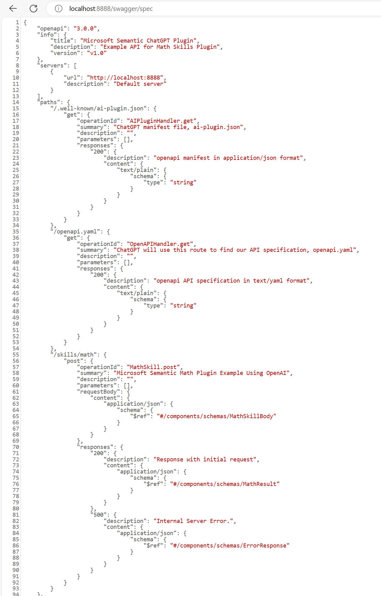

# semantic-kernel-example-ChatGPT-Plugin
Microsoft Semantic Kernel - Example application creating ChatGPT plugin using Native and Semantic function with Python and Azure Function App. In this example code, we demonstrate how to combine native functions with semantic functions to correctly answer word problems like What is the "square root of 634?", "square root of 144", "What is 42 plus 1513" or "multiply 2 times 4", etc.

In this example, the code plugin is built with OpenAI standard specifications. The example uses a plugin manifest file that points to an accompanying [OpenAPI](https://www.openapis.org/) specification. Plugins defined in this way can be used by any application supporting the OpenAI specification, including Semantic Kernel and ChatGPT.

## Microsoft Semantic Kernel

The [Microsoft Semantic kernel](https://learn.microsoft.com/en-us/semantic-kernel/ai-orchestration/kernel/?tabs=Csharp) is responsible for managing resources that are necessary to run "code" in an AI application. This includes managing the configuration, services, and plugins necessary for native code and AI services to run together.

Semantic Kernel makes it easy to run AI services alongside **native code** by treating calls to AI services as their first-class citizens called "semantic functions."

## AI Plugins

[AI Plugins](https://learn.microsoft.com/en-us/semantic-kernel/ai-orchestration/plugins/?tabs=Csharp) in Semantic Kernel are the fundamental building blocks of Semantic Kernel and can interoperate with plugins in ChatGPT, Bing, and Microsoft 365. With plugins, you can encapsulate capabilities into a single unit of functionality that the kernel can run. Plugins can consist of both **native code** and requests to AI services via **semantic functions**.

### Out-of-the-box Plugin

To provide a degree of standardization across Semantic Kernel implementations, the GitHub repo has several plugins available out-of-the-box depending on the language you are using. These plugins are often referred to as [Core plugins](https://learn.microsoft.com/en-us/semantic-kernel/ai-orchestration/plugins/out-of-the-box-plugins?tabs=python#core-plugins). 

In this example we are using `ConversationSummarySkill` to summarize a conversation with `GetIntent` semnatic function.

### Semantic Functions

Semantic Functions listen to users' asks and respond with a natural language response within your AI app. AI app operates very much like the human body; the Prompt represents "Ear", the Response as "Mouth", and the LLM model as "brain". Semantic Kernel uses connectors to connect the Prompt and the Response to the "brain". This allows you to easily swap out the AI services ("brain") without rewriting code.

We are going to use [Semantic Kernel prompt template language](https://learn.microsoft.com/en-us/semantic-kernel/prompt-engineering/prompt-template-syntax) to create natural language prompts, generate responses, extract information, etc.

#### `GetIntent` 

[`GetIntent`](./plugins/OrchestratorPlugin/GetIntent/) Semantic function is defined to understand the intent of a user's input and then take some action based on that intent. The following [configurations](https://learn.microsoft.com/en-us/semantic-kernel/prompt-engineering/configure-prompts) and out-of-the-box plugins are added to the intent so that the LLM chooses the correct intent.

- options - We want the LLM to choose the correct intent; for that, we are using the `options` configuration to choose the correct intent by providing it with more context and a constrained list of options.
- history - A history variable is added to the prompt configuration to include the previous conversation.
- [ConversationSummarySkill](https://learn.microsoft.com/en-us/azure/architecture/ai-ml/guide/conversation-summarization) Plugin - Summarize the conversation history before asking for the intent; this will avoid too many tokens being used.

#### `GetNumber`

[`GetNumber`](./plugins/OrchestratorPlugin/GetNumbers/) semnatic function is defined to pull the numbers from the user's input. This semantic function uses few-shot learning (user defined example conversation) to demonstrate to the LLM how to correctly extract the numbers from the user's request and output them in JSON format. This will allow us to easily pass the numbers to the Sqrt and Multiply functions.

#### `CreateResponse`

[`CreateResponse`](./plugins/OrchestratorPlugin/CreateResponse/) smenatic function si defined to create resonse for with original_request.

### Native Functions

With Native Functions, you can have the Semantic kernel call C# or Python code directly so you can manipulate data or perform other operations, perform a task LLMs cannot do easily on their own. For example, you want to perform a task based on the intent that can be achieved using Semantic Functions. Now, if the user wants to send an email, you'll need to make the necessary API calls to send an email; this can be done using Native Functions.

#### Math Functions (Math.py File)

All native functions are public methods of [Math.py](./plugins/MathPlugin/Math.py) class that represents your plugin. Using [SKFunction decorator](https://learn.microsoft.com/en-us/semantic-kernel/ai-orchestration/plugins/native-functions/using-the-skfunction-decorator?tabs=Csharp#use-the-skfunction-decorator-to-define-a-native-function) we inform Semantic Kernel that It is a native function and will automatically register it with the kernel when the plugin is loaded.

### ExtractNumbersFromJson

The `ExtractNumbersFromJson` native function takes the JSON string from the input variable and extract the numbers from it into the context object. 

#### RouteRequest

[RouteRequest](./plugins/OrchestratorPlugin/OrchestratorPlugin.py) is another Native function; It will leverage Semantic Functions (`GetIntent` and `GetNumber`) and call the appropriate Native functions (Math functions) based on the user's intent. Since the RouteRequest function helps orchestrate the flow, we have added the same to the `OrchestratorPlugin` plugin. The `route_request` function is decorated using the SKFunction decorator to inform Semantic Kernel that It is a native function. This plugin will run other functions, we'll need to pass the kernel to the plugin during initialization.

Using Semantic Kernel piping capabilities we orchestrates (semantic and native functions) pipelines with an `input` variable in the context object; It allows you to stream output from one semantic function to the next.

   `get_numbers` -> `extract_numbers_from_json` -> `math_function` -> `create_response`

## Kernel Util

The Kernel util loads the kernel with all the functions that are needed by the RouteRequest function. If we do not appropriately load the GetIntent, GetNumbers, Sqrt, and Multiply functions, If we do not appropriately load the GetIntent, GetNumbers, Sqrt, and Multiply functions, the RouteRequest function will fail when it tries to call them.

## ChatGPT Plugin

The ChatGPT Plugin consists of three things: an app wrapped in an API, a manifest file, and an OpenAPI specification.

## Prerequisites

- [Azure Functions Core Tools](https://www.npmjs.com/package/azure-functions-core-tools)
- [VSCode](https://code.visualstudio.com/download)
- Python >= 3.10
- OpenAI API Key
- Setup python venv

## Implementations

We have two different ways to expose Semantic Kernel plugin:

#### Using [Python Flask](https://flask.palletsprojects.com/en/3.0.x/) Framework with [Azure Functions](https://learn.microsoft.com/en-us/samples/azure-samples/flask-app-on-azure-functions/azure-functions-python-create-flask-app/)

It exposes following [endpoints](./SemanticApp/main.py):

1. Plugin manifest endpoint - `/.well-known/ai-plugin.json`
2. OpenAPI Specification endpoint - `/openapi.yaml`
3. Function endpoint - `/skills/math`

*[`./SemanticApp/openapi.yaml`] is created from `/swagger/spec` API exposed from [Python Tornado Sswirl](https://github.com/rnduldulaojr/tornado-swirl)

#### Using [Python Tornado](https://www.tornadoweb.org/en/stable/) Web Server

It exposes following [endpoints](./tornadoapp/main.py); where OpenAPI specs are created using [Python Tornado Sswirl](https://github.com/rnduldulaojr/tornado-swirl):

1. Plugin manifest endpoint - `/.well-known/ai-plugin.json`
2. OpenAPI Specification endpoint - json format `/swagger/spec` and UI `/swagger/spec.html`   
  
   
  
3. Function endpoint - `/skills/math`

## How to run?

#### From Command Line or Powershell:

- Activate Python venv
- Append root directory of the project to PYTHONPATH
- `pip install -r requirements.txt`
- run `func host start` to start Azure function application on port 7070
- run `python .\tornadoapp\main.py` to start Tornado webserver at port 8888

#### From VSCOde:

Run from VSCode, [follow steps](https://learn.microsoft.com/en-us/azure/azure-functions/functions-develop-vs-code?tabs=node-v3%2Cpython-v2%2Cisolated-process&pivots=programming-language-csharp#run-functions-locally)

The [launch.json](./.vscode/launch.json) has the configuration for "Python: TornadoApp" and "Attach to Python Functions." Using "Run & Debug," you can start Azure Function locally or Tornado Web Server.

Invoke Math Skill:

`curl --request POST http://localhost:<<port>>/skills/math -H "Content-Type: application/json" -d "{\"prompt\":\"square root of 144?\"}"`

## Planner

The [Orchestrator](./plugins/OrchestratorPlugin/OrchestratorPlugin.py) orchestrated all of the functions on behalf of the user. This, however, is not a scalable solution because it would require the app developer to predict all possible requests that the user could make. So instead, we can use [planner](https://learn.microsoft.com/en-us/semantic-kernel/ai-orchestration/planners/?tabs=Csharp) to automatically orchestrate functions on the fly using a planner.

You can read more about the [planner](https://learn.microsoft.com/en-us/semantic-kernel/ai-orchestration/planners/?tabs=Csharp) and [when to use](https://learn.microsoft.com/en-us/semantic-kernel/ai-orchestration/planners/?tabs=Csharp#when-to-use-planner).

The [client application](./planner_client_app.py) has an example code using `SequentialPlanner`, in this example, we are importing the plugin using locally (:information: not remotely by importing plugin from manifest URL,I did not find API for Python similar to C# `kernel.ImportChatGptPluginSkillFromUrlAsync`)

You can run this application from VSCode using "Run & Debug" or from the terminal (`pip install requirements.txt` and Append the root directory of the project to PYTHONPATH).

## Deploy

You can deploy Semantic Kernel to Azure using Azure functions by following steps [listed here.](https://devblogs.microsoft.com/semantic-kernel/how-to-deploy-semantic-kernel-to-azure-in-minutes/)

# Explore More

In this example we have manually orchestrated (using RouteRequest) all of the functions on behalf of the user. This, however, is not a scalable solution because it would require the app developer to predict all possible requests that could be made by the user. So instead, we will learn how to automatically orchestrate functions on the fly using planner.

